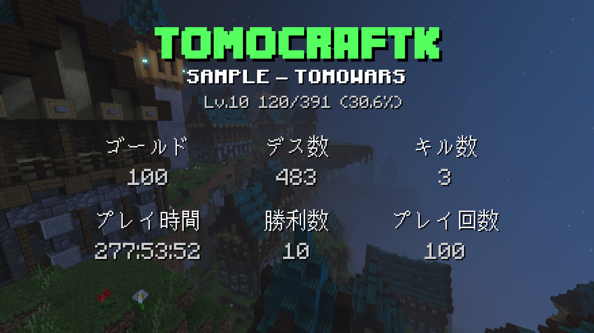

# STATS BOT

## このプロジェクトについて

このソースは以下のような画像を Discord Bot を介して作成できるようにするものです。<br>
何か他のプロジェクトなどに使用する場合は、[@BreadAwful](https://twitter.com/breadawful) にDMを送っていただけると励みになります。是非、参考にしてください。<br>



## 注意事項

当ソースを実行するには、「[Node.js](https://nodejs.org/)」の環境が必要となります。もし環境が整っていないのであれば、「[Node.js](https://nodejs.org/)」をダウンロードしてください。


## 実行手順

1. このソースをZIPファイルとしてダウンロードした後に解凍してください。
2. コマンドプロンプトを起動して、`npm install` を実行してください。
3. 「[Discord Developer Portal](https://discord.com/developers/applications)」にて BOT を作成してください。
4. BOT のトークンを取得したら `index.js` の中の `token` (以下参照)を BOT のトークンに置き換えてください。
```js
const token = 'Your discord bot token';
// 「'Your discord bot token'」をBOTのトークンに置き換える
```
5. このままではフォントが適用されないため、フォントを実際にこのプログラムを実行する実機にインストールしてください。（使用フォント「Minecrafter」、「Mojang」、「OpenMine」、「Unifont」）
6. その他好みでテキストなどを変更したりした後、コマンドプロンプトで `node index.js` を実行して下さい。
7. 問題無く立ち上がった場合は、Discord にて `/stats <mcid>` コマンドが実行できるか確かめてください。（MCID毎のデータは `players.json` を書き換えて設定して下さい）
8. ここまで問題無く済めば成功です。もし不明な点等があれば、[LINE OPENCHAT](https://line.me/ti/g2/RSb0ymAKXxOsPaFCxAOtHM8tT8CpyU43N9dZNg?utm_source=invitation&utm_medium=link_copy&utm_campaign=default) または [X(旧Twitter)[@BreadAwful]](https://twitter.com/breadawful) のDMにて質問お願いします。

## 製作者

* <h3>Tomocraft</h3>

  * [X(旧Twitter) - @BreadAwful](https://twitter.com/breadawful)
  * [Github - tomocraft](https://github.com/tomocraft)
  * [HomePage](https://tomocraft.github.io/)
  * [YouTube - Tomoクラフト](https://youtube.com/@Tomo-craft)